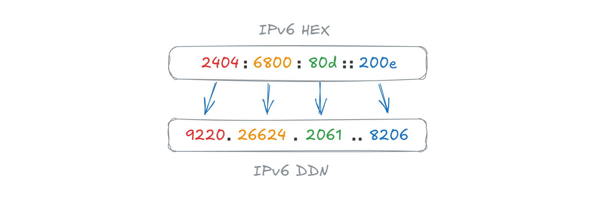

# IPv6 Decimal Dot Notation (IPv6-DDN)

<!-- @import "[TOC]" {cmd="toc" depthFrom=2 depthTo=4 orderedList=false} -->

<!-- code_chunk_output -->

- [1. Overview](#1-overview)
- [2. Introduction](#2-introduction)
  - [2.1 Requirements Language](#21-requirements-language)
- [3. Format Definition](#3-format-definition)
  - [3.1 Basic Structure](#31-basic-structure)
  - [3.2 Zero Compression](#32-zero-compression)
- [4. ABNF Syntax Specification](#4-abnf-syntax-specification)
- [5. Text Representation and Canonicalization](#5-text-representation-and-canonicalization)
  - [5.1 Leading Zeros](#51-leading-zeros)
  - [5.2 Zero Compression Rules](#52-zero-compression-rules)
- [6. Examples](#6-examples)
- [7. Parsing Guidelines](#7-parsing-guidelines)
- [8. Security Considerations](#8-security-considerations)
  - [8.1 Ambiguity with IPv4](#81-ambiguity-with-ipv4)
  - [8.2 Buffer Handling](#82-buffer-handling)
- [9. Libraries](#9-libraries)
- [10. Specification](#10-specification)
- [11. License](#11-license)

<!-- /code_chunk_output -->

## 1. Overview

This document defines "IPv6 Decimal Dot Notation" (IPv6-DDN), an alternative text encoding format for 128-bit IPv6 addresses. Unlike the standard hexadecimal colon-separated representation (RFC 4291), IPv6-DDN represents the address as eight 16-bit decimal integers separated by periods (dots).

Essentially, each 16-bit segment of the IPv6 address is expressed as a decimal number in the range `0` to `65535`, with segments separated by a dot (`.`). To compress sequences of zero-valued segments, a double dot (`..`) is used, analogous to the `::` notation in standard IPv6.



This format aims to enhance readability for human operators familiar with IPv4 syntax and provides a unified visual delimiter style for IP addresses. The specification includes ABNF syntax, canonicalization rules for zero compression, and parsing requirements.

> IPv6-DDN is not a standard and is not intended to replace standard IPv6 notation, it's originally used in _XiaoXuan Shell_, _XiaoXuan Terminal_ and related applications.

## 2. Introduction

The standard text representation of IPv6 addresses uses hexadecimal numbers separated by colons. While efficient for machine representation, this format can be error-prone for human transcription and visual scanning. IPv6-DDN maps the 128-bit address space into a format syntactically similar to IPv4 but extended to support the larger address space of IPv6.

### 2.1 Requirements Language

The key words "MUST", "MUST NOT", "REQUIRED", "SHALL", "SHALL NOT", "SHOULD", "SHOULD NOT", "RECOMMENDED", "MAY", and "OPTIONAL" in this document are to be interpreted as described in RFC 2119.

## 3. Format Definition

### 3.1 Basic Structure

The IPv6 address is treated as a sequence of eight 16-bit unsigned integers.

- Segments: The address is divided into 8 fields (segments).
- Values: Each segment is represented as a decimal number ranging from `0` to `65535`.
- Separator: Segments are separated by a single period character (`.`, ASCII 0x2E).
- Encoding: Characters MUST be encoded in US-ASCII.

### 3.2 Zero Compression

To reduce the length of the representation, a sequence of contiguous segments containing the value `0` MAY be replaced by a double period (`..`). This is functionally equivalent to the `::` compression in standard IPv6.

## 4. ABNF Syntax Specification

The syntax of IPv6-DDN is defined using the Augmented Backus-Naur Form (ABNF) as specified in RFC 5234.

```abnf
; IPv6 Decimal Dot Notation ABNF

IPv6-DDN      = full-address / compressed-address

; 1. Full Address (No compression)
full-address  = 7(dec-hextet ".") dec-hextet

; 2. Compressed Address (Contains "..")
compressed-address = prefix-comp / infix-comp / suffix-comp / empty-comp

; Compression at the beginning (e.g., ..1.2)
prefix-comp   = ".." 1*7(dec-hextet ".") dec-hextet

; Compression in the middle (e.g., 1..2)
infix-comp    = component ".." component
component     = 1*6(dec-hextet ".") dec-hextet

; Compression at the end (e.g., 1.2..)
suffix-comp   = 1*7(dec-hextet ".") dec-hextet ".."

; Unspecified Address (:: corresponds to ..)
empty-comp    = ".."

; 3. Basic Definitions
; 16-bit decimal value (0-65535) without leading zeros
dec-hextet    = "0" / (1*9DIGIT) 

; Semantics Note: Parsers MUST validate that the numeric value 
; of dec-hextet does not exceed 65535.
; DIGIT is defined in RFC 5234 as 0-9.
```

## 5. Text Representation and Canonicalization

To ensure a unique and consistent representation for any given 128-bit integer, the following canonicalization rules MUST be applied when generating IPv6-DDN strings.

### 5.1 Leading Zeros

Leading zeros within a single segment MUST be suppressed.

- Correct: `192.0.65535`
- Incorrect: `00192.00000.65535`

### 5.2 Zero Compression Rules

The use of `..` to compress zeros MUST adhere to the following logic (consistent with RFC 5952):

1. Longest Run: The longest sequence of consecutive zero-valued segments MUST be compressed.
2. Leftmost Preference: If there are multiple zero sequences of equal length, the leftmost sequence MUST be compressed.
3. Singularity: The symbol `..` MUST NOT appear more than once in an address.
4. Minimum Length: Compression SHOULD only be applied to sequences of two or more zero segments. However, compressing a single zero segment is syntactically valid if it follows the "Longest Run" rule.

## 6. Examples

The following table compares standard Hexadecimal IPv6 notation with the IPv6-DDN format.

| Description    | Standard IPv6 (Hex)  | IPv6-DDN (Decimal)    | Notes                      |
| -------------- | -------------------- | --------------------- | -------------------------- |
| Loopback       | `::1`                | `..1`                 | First 7 segments are 0     |
| Unspecified    | `::`                 | `..`                  | All segments are 0         |
| Standard       | `2001:db8::1`        | `8193.3512..1`        | Hex 2001 = Dec 8193        |
| Max Value      | `ffff:ffff:...:ffff` | `65535.65535...65535` | No compression possible    |
| Multiple Zeros | `2001:0:0:1:0:0:0:1` | `8193.0.0.1..1`       | Compressing the longer run |
| Boundary       | `2001:000a:0100::`   | `8193.10.256..`       | Leading zeros removed      |

## 7. Parsing Guidelines

When implementing a parser to convert an IPv6-DDN string into a 128-bit binary address:

1. Splitting: Split the string by the `..` delimiter. If more than one `..` exists, the address is invalid.
2. Counting: Count the number of segments on the left and right of the `..`.
3. Expansion: Calculate the number of missing segments: `N = 8 - (count_left + count_right)`. Insert `N` zero-valued segments between the left and right parts.
4. Conversion: Convert each decimal string segment into a 16-bit integer.
5. Validation: Ensure exactly 8 segments exist after expansion, and each segment value $v$ satisfies $0 \le v \le 65535$.

## 8. Security Considerations

### 8.1 Ambiguity with IPv4

Both IPv4 and IPv6-DDN use the dot (`.`) as a separator.

- Risk: An IPv6-DDN address like `0.0.0.0.0.0.0.1` could be confused with an extended IPv4 format or cause buffer over-reads in IPv4-only parsers.
- Mitigation: Parsers MUST distinguish formats by checking for the `..` token, checking segment counts (IPv4 has 4, IPv6-DDN has 8), or checking for segment values \> 255.

### 8.2 Buffer Handling

Unlike hexadecimal (max 4 chars per segment), decimal segments can have up to 5 characters (`65535`). Parsers allocating fixed-width buffers based on standard IPv6 assumptions MUST adjust buffer sizes to accommodate the maximum IPv6-DDN string length (47 characters).

## 9. Libraries

- JavaScript: [ipv6-ddn](https://www.npmjs.com/package/ipv6-ddn)
- Rust: [ipv6-ddn](https://crates.io/crates/ipv6-ddn)

## 10. Specification

[Specification v1.0.0](https://github.com/hemashushu/ipv6ddn)

## 11. License

This document is provided under the Creative Commons Attribution 4.0 International (CC BY 4.0) License. This license enables reusers to distribute, remix, adapt, and build upon the material in any medium or format, so long as attribution is given to the creator (Hemashushu <hippospark@gmail.com>). The license allows for commercial use.

For more details, see the full license text at <https://creativecommons.org/licenses/by/4.0/>
